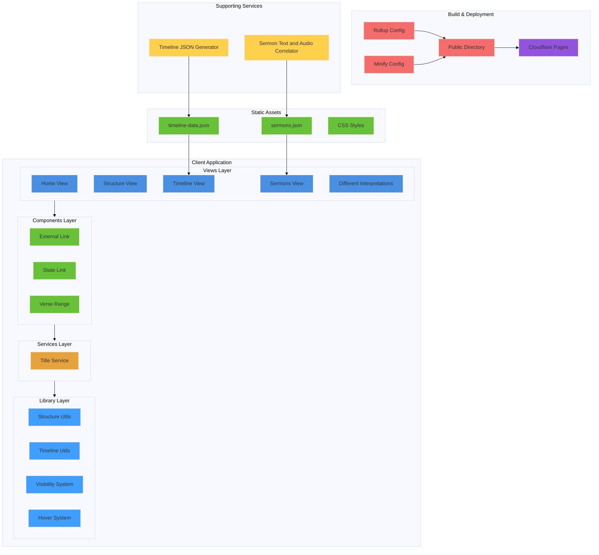

# [Revelation Project](https://revelation.biblicalblueprints.com/)

## Deploy

This site is deployed on merges to `master` using Cloudflare Pages.

## Local Dev

To run locally, first install Node.js and then run:

```bash
npm install
```

Then you will need to run setup:

```bash
npm run prep-build
npm run build-prod
```

All files will be built into the [public](/public) folder, so you can serve that with your tool of choice.

One way is to run:

```bash
npx http-server public
```

(Have a look at [http-server](https://www.npmjs.com/package/http-server) for options.)


## Mermaid Diagram of the Project

